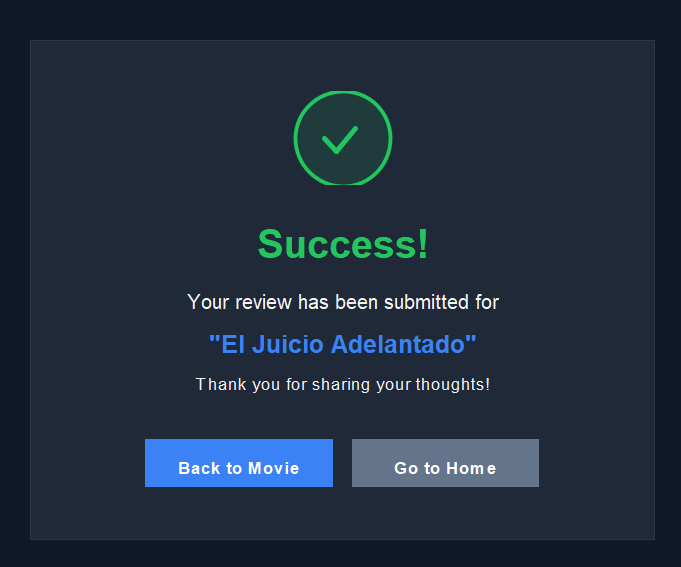

# Team Project

Please keep this up-to-date with information about your project throughout the term.
Names: Kosi, Erik, Keishi, Simone, Eileen
The readme should include information such as:
- Summary:

  An app that allows for users to search and add movies and tv-shows to their watchlist. This allows users to keep note of what they would like to watch in the future. Movie data will be supplied via an external API. Users can also mark movies as their favorite and search through both tv and movie titles by genre, release date, rating, and several more.
 
 
- User Story and Use Cases:

  Sign Up: Yihe Xiao
  
  Login/Logout: Yihe Xiao

  Add To Watchlist: Kosisochi Okaro

  Load Watchlist: Kosisochi Okaro
  
  Add To Favorites: Keishi Suzuki
  
  Delete From Favorites: Keishi Suzuki
  
  Load Favorites: Keishi Suzuki
  
  View Favorites: Keishi Suzuki
  
  Rate and Comment: Yihe Xiao

  Clicking View:

  Browse Movies:
 
 
- information about the API(s) that your project uses:

- screenshots or animations demonstrating current functionality:
  
  

Screenshot of the favorites view after adding a movie.  

  
  - Rate and Comment:

By keeping this README up-to-date,
your team will find it easier to prepare for the final presentation
at the end of the term.
